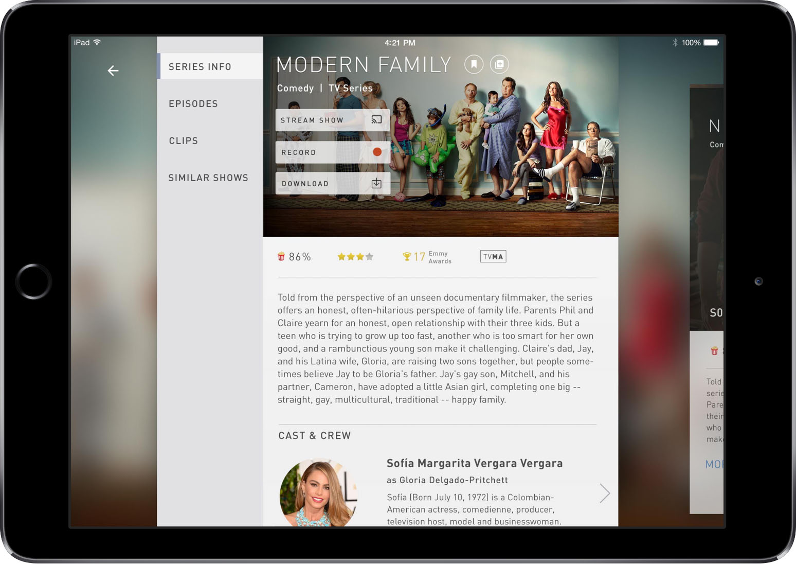

##Discover

Parallel to their regular output and updates, DTV began a separate project in late 2014 aimed at creating a design language that unifies native application and web experiences. TS was tagged to help ideate on how this next generation product might look and work. 

The client provided some basic user personas, and from there we were able to create user-journeys. The requirements of the product were quite vague, but we knew they were looking for a core design model that would frame this product. Cards are a popular metaphor at the moment; one that they both hoped to use, but also push beyond. In a dream one day, our lead UX designer came up with something that stuck: *the Wave*. She imagined the user diving through the application, immersing themselves into the content. The metaphor has stuck, and even given the project a working name. 

	

As you can imagine, DIRECTV is a large organization that defines the direction of their own products, even when 3rd party agencies like TS are integrated into their teams. Months passed between the end of Discovery, and our reengagement with their team, who was ready for some heavy lifting work to be done. They came back with an initial direction for a product that borrowed heavily from our original concept, but with more of their specific business considerations applied. Functionality that previously was undefined was more concrete now. We now knew we needed:
- Streaming on-demand content
- Live TV streams and guides
- Recording management tools
- Room for additional CTAs as business requirements grew (purchase, download, etc)

They had a basic foundation established, but still had a lot of work to do. Because of their stakeholder and development team review cycles, we tackled one area at a time. For each of these areas we needed to understand the core requirements, do some research and execute designs in high fidelity. Stakeholder and client reviews were demanding as well, so our work needed to be wrapped in a convincing story.

##Delivery Framework
After a few weeks of working this way, we were able to formalize the delivery framework, which allowed us to focus on product challenges instead of the process. It may sound terribly simple and obvious to an experienced designer, but anyone who’s navigated through massive projects like this will understand the challenge associated with getting disparate parties aligned on one process:

1. Define the problem
2. UX Background Research
3. User Flows
4. Initial ideas
5. Low Fi Prototype
6. High Fidelity Keyscreens
7. High Fidelity Prototype
8. Documentation & Presentation

We've since adapted this general process to other projects that work in a retainer model.

**Show Detail**  
For the purposes of this case study, I’ll pick one series of iterations we did when exploring the Browse experience (as opposed to Watch or Discover).  

1. *Define the problem*  
A Show has three layers: show, season, and episode, and actions can be taken across all three levels. The design must be adaptable to different sizes, and be as ‘immersive’ as possible.

2. *Background Research*  
We looked at their existing product as well as other products that have tried to solve similar problems.

3. *User Flows*  
At this early stage of development the client wanted to focus on the *happy flows*: straightforward paths utilizing the product’s primary functionality.

4. *Initial ideas*  
We sketched out some basic ideas and explored different patterns that would let the user move between content types without getting overwhelmed.

5. *Low Fi Prototype*  
We put a few basic approaches into inVision to validate that we were moving in the right direction with the client before getting too bogged down in details  

6. *High Fidelity Screens*  
Now a designer creates a small number of key screens put together in high fidelity to make the idea start to feel real. 

7. *High fidelity prototype*  
Now we bring it all together into a basic prototype so that the full flow can be visualized in high fidelity, and we can even begin exploring interactino details like hover states and transitions.

8. *Documentation*  
We wrap everything up in a presentation for the client, and walk  them through our progress and how we got there. On occasion they make specific requests for things like specced up comps or annotated wireframes, which we of course provide.

	

	  
	  
	  Background Research, including existing product and competitors
	

	
	

		
	

	

		
		
		
	

	

		

			<iframe width="956" height="682" src="//invis.io/BQ2WG33XY" frameborder="0" allowfullscreen></iframe>
		

		<a class="button tertiary" href="https://invis.io/S92WG32RT">Tablet Prototype in Invision</a>
	

	

		
		
	

	

		
		
	

	

		
		
	

	

		

			<iframe width="956" height="682" src="//invis.io/9T33P2IQB" frameborder="0" allowfullscreen></iframe>
		

		<a class="button tertiary" href="https://invis.io/SU33P2HYM">Tablet Prototype in Invision</a>
	

——

This is only one small part of the product we examined through this framework. Other iterations called for coded prototypes, content modeling, and deeper feature mapping. But the above steps are a basic representation of how we work with this and other clients. 

