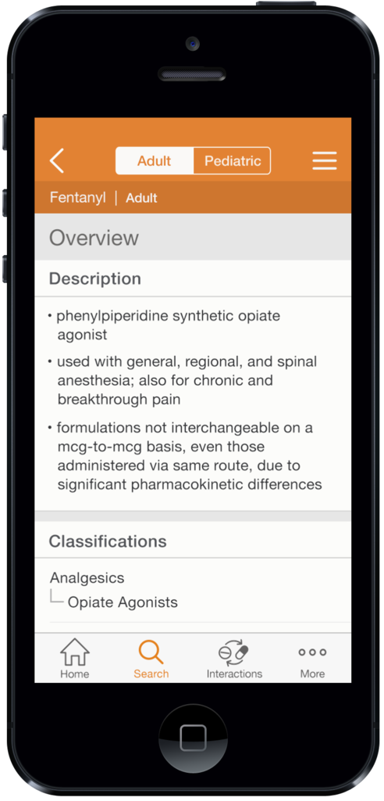

##Discover  
They approached us with a fairly defined problem: their [Clinical Pharmacology](https://www.clinicalpharmacology.com/) product is widely used on desktop computers, but they want to make it available for use on mobile and tablet devices. Offline use was a technical requirement, and increasing the company’s app-store presence was an initiative from the marketing department.

**Technical**  
Based on these requirements we knew we needed native applications. Our Technical Lead began working with the client's Database Manager, and soon they were able to work out the basic structure and how we could integrate.  

**User**  
Workshops, surveys and interviews helped us understand the features offered by the client's current services and the key features for most users. We created a handful of personas to help frame the experience, and decided on some core features for an initial launch: *Search*, *Monographs*, and *Interactions*.

	
	
	

##Define

With the requirements that came out of Discovery we were able to start defining the overall approach for the project. We concluded that we needed to focus not on gimmicky graphics or creating a ‘branded experience’, but instead on providing a functional tool for medical professionals. We therefore agreed that UI & UX patterns defined by Apple and Android in their well-documented guides should form the foundation of the experience. Where necessary we could branch out, but our hypothesis was that starting with these guides would help make the complex application as easy to learn as possible.

Branding was of course still a part of the process, so we made sure to create a visual direction that the marketing team was happy with. As always in this phase we deliver a style tile to help establish design direction for the product.

	

##Create

**Design**  
Our core team was made up of a superstar Project Manager, a Tech lead, my trusty design-partner [Jess](http://www.jessdale.com/), and myself. We worked in two week design sprints, quickly researching, sketching, and prototyping ideas to validate with the relevant professionals on the client’s side.

	
	

	

		<iframe width="396" height="818" src="//invis.io/GZ4F6AXN5" frameborder="0" allowfullscreen></iframe>
	

	<a class="button tertiary" href="https://invis.io/SKMR82F4">Mobile Prototype on InVision</a>

	
	
	
	
	

The problems were complex, working with datasets that came from multiple sources, and often with lengthy text. Depending on the source of the data, we were not always able to format or organize the text in the way we wanted, but we still did all we could to keep information well labeled and clear.

**Test**  
We were lucky enough to get in some formal user testing during the design process. We brought in about 10 participants with professional relevancy and ran through a series of tasks using a number of inVision prototypes.

We were happy to find that most participants completed the tasks with relevant ease, and for the most part had positive feedback. Less happily, but valuably, we also found a small number of key design decisions that proved to hindrances in the experience. If I learned nothing from this whole project, at least I’ll know to be more careful with this pattern:

	
	

**Document**  

The development team required specs, every designer’s favorite part of the job. I sat down with both iOS and Android guys to find out what information was most useful for them, and I tried to think of a way to make all of our jobs a bit easier. In my previous life I had done a fair amount of front-end development, and wanted to repeat some of the principles I worked with such as [DRY](https://en.wikipedia.org/wiki/Don%27t_repeat_yourself). Though I didn’t have the time to put together the documents as well as I would have liked, I did create what the team referred to as a “dictionary”, with a summary of tags and descriptions that I used throughout my spec document. I believed that this could work in a way similar to how SASS allows developers to use mixins to create a library of components that can be pulled in and modified as necessary.

	

##Evaluate  
The application was developed within a few more months, and underwent a QA process before getting a soft launch to a small group of pharmacists. A second round of QA followed and the app was released to a larger group. The app is currently available on both iOS and Android, with largely favorable reviews and positive feedback from the client.

Basic analytics and surveys have revealed that a few more core features probably need to be included, and a few designs tweaked. Access across even more devices will also be critical for future success, and tablet versions are already being planned.

<a class="button tertiary" href="https://itunes.apple.com/us/app/elsevier-clinical-pharmacology/id923081157?mt=8">View on App Store</a>
<a class="button tertiary" href="https://play.google.com/store/apps/details?id=com.elsevier.elseviercp&hl=en]">View on Google Play</a>
