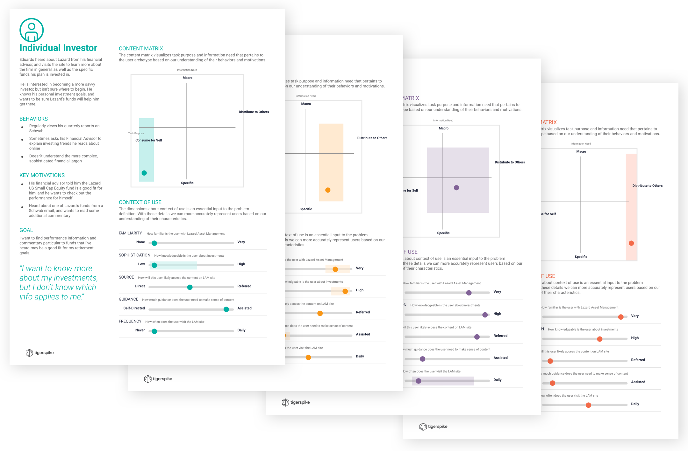
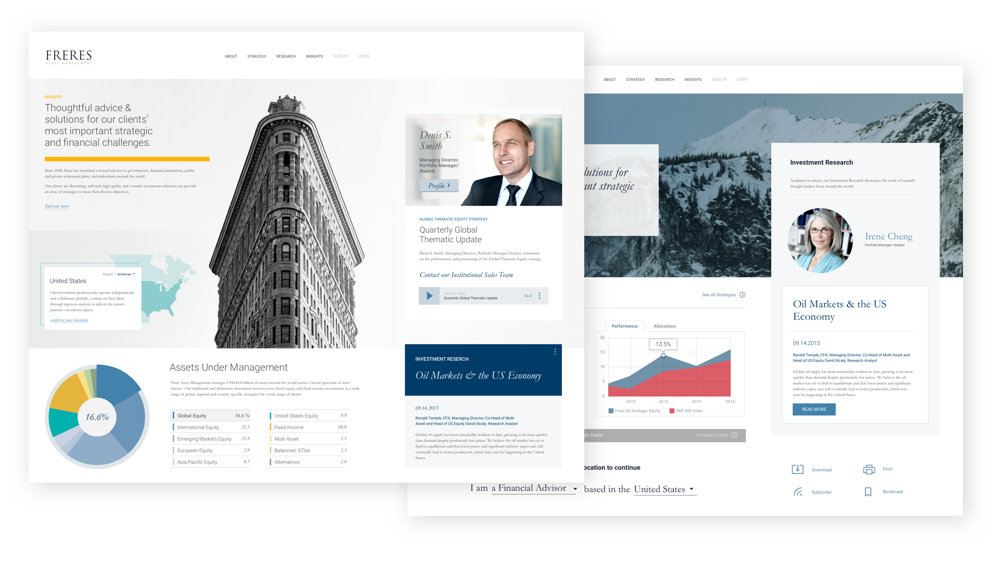
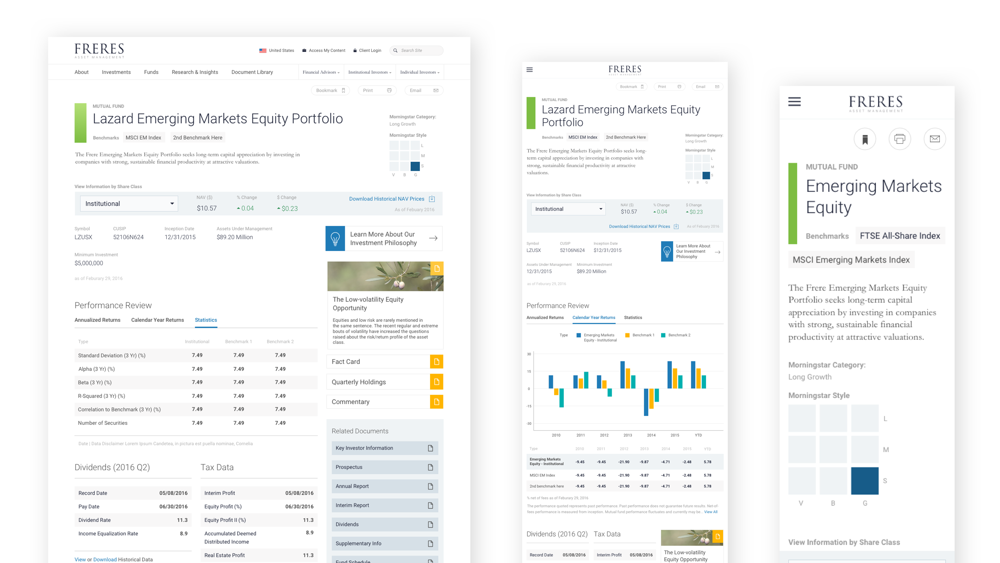
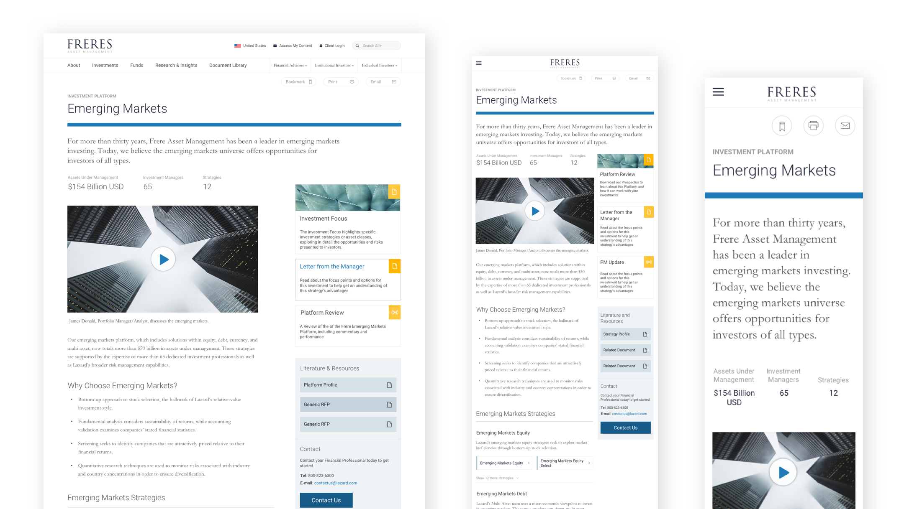
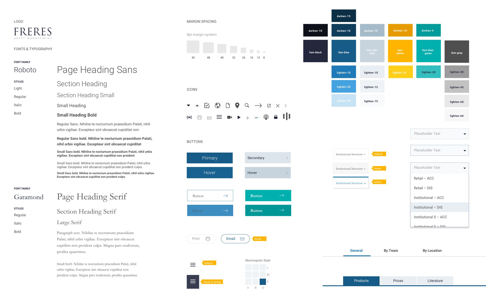

## UX Research

As with all major projects, we began this one by establishing a foundation. Who uses FAM's site? Why do they come here? What are they looking for? From what device and what environment are they accessing the site? Once found, what do they do with that information?

Through a series of interviews and surveys, we began noticing some basic patterns, from which we were able to establish a few baseline personas, a few of which we ended up focusing on through the rest of the project.

    
    
FAM project personas

A defining tenet of information-sharing in the world of global finance is the degree of regulations in place, not to mention individual organizations' interpretation of those regulations. A basic survey of existing products revealed two models:

- **Specified Model**: Force users to choose their country up front, followed by their status as a "financial professional", which is required by most countries to show certain types of financial information.
- **Open Model**: Allow users to browse as much of the global website as possible before asking them for information regarding their residence or professional status.

We began the project with the Open Model as our choice, but with the knowledge that legal department heads may, in the end, veto that decision.

## Visual Research

Parallel to the UX Research I worked with a brand designer to help define a visual direction for the website. Probably one of the most challenging aspects of this whole project was incorporating visual and brand thinking into a project that was mostly focused on technical and UX thinking.

FAM has a parent company, with whom they need to share a logo and basic branded components such as type and color palettes. However, they also wished to distinguish themselves from the corporate umbrella, and wished to push their image as much as they could.

We presented two style tiles, a sort of refined mood-board adapted to suit projects where a basic brand might be in place, but interface patterns are not.

    
    
Two style tiles presented to the FAM board

## Designs
we worked iteratively in a sprint based approach to work through major parts of the site at a high level before deciding which parts required the most focus.

In the end we found that **Funds** and **Investment Strategies** were the key products that made up the firm. They were also the most complex, because every country had varying quantities of funds and strategies, classified them differently, and had varying amounts of information available for each one.

It meant that the templates for these pages had to be more structured than we would have liked, but we were happy they could serve the needs of the client and felt they were a good starting point.

    
    
    
Responsive Fund and Strategy templates for use across all global branches

## Style Guide

After the site was developed, it would be inherited and maintained by FAM's own small internal team, so we included a detailed style guide as part of our handover.

It was meant to be shared by the IT teams across the globe so that they could edit and add to their sites as necessary without losing the structure and mood of the site as a whole.

    
    
A sheet of basic styles and components, just one part of an expansive style guide distributed to IT teams across the world

## Learnings

While a public facing website, the target users for this site were financial professionals. By far the largest challenge to this whole project was learning the language of these professionals, a language with which I had little to no background. The depth of the challenge only grew as I learned that this language had dialects of its own, and terms such as Investment Strategies can have very precise and codified meanings at one institution, while a quite different one at another, but with a few key consistencies.

After about 6 months on the project, I began to become fluent in the dialect of financial and marketing terminology used at FAM, which was a personal turning point for me. After a half of a year of accepting previously unchallengeable statements from the client, I all of a sudden had the vocabulary to truly have a dialogue.

I can't emphasize enough how critical it is that client and designer are able to have a dialogue with a set of basic, shared understandings. Industries such as finance, health, law, and government have such specific terminologies and processes, that establishing those shared understandings is particularly difficult. I can now say that I understand why so much design material that comes from organizations within those fields falls so flat.
