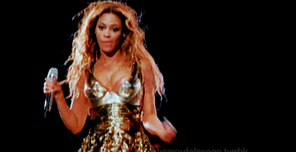
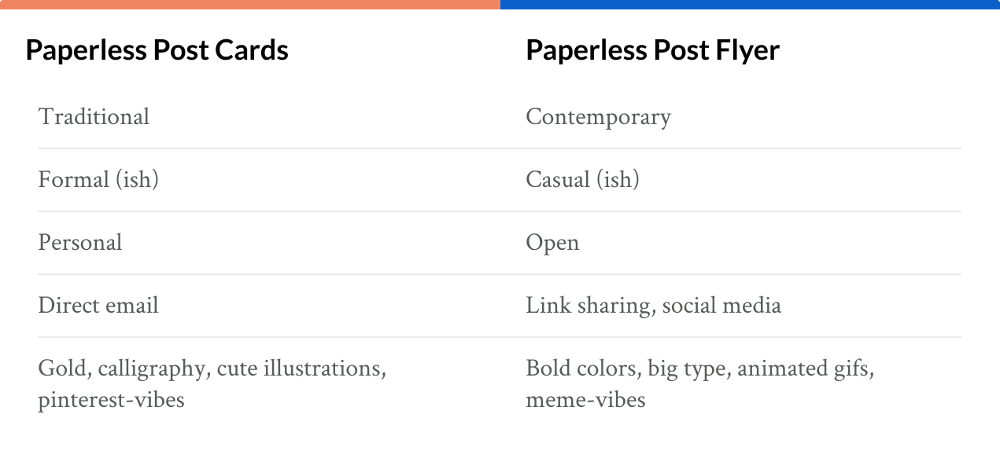
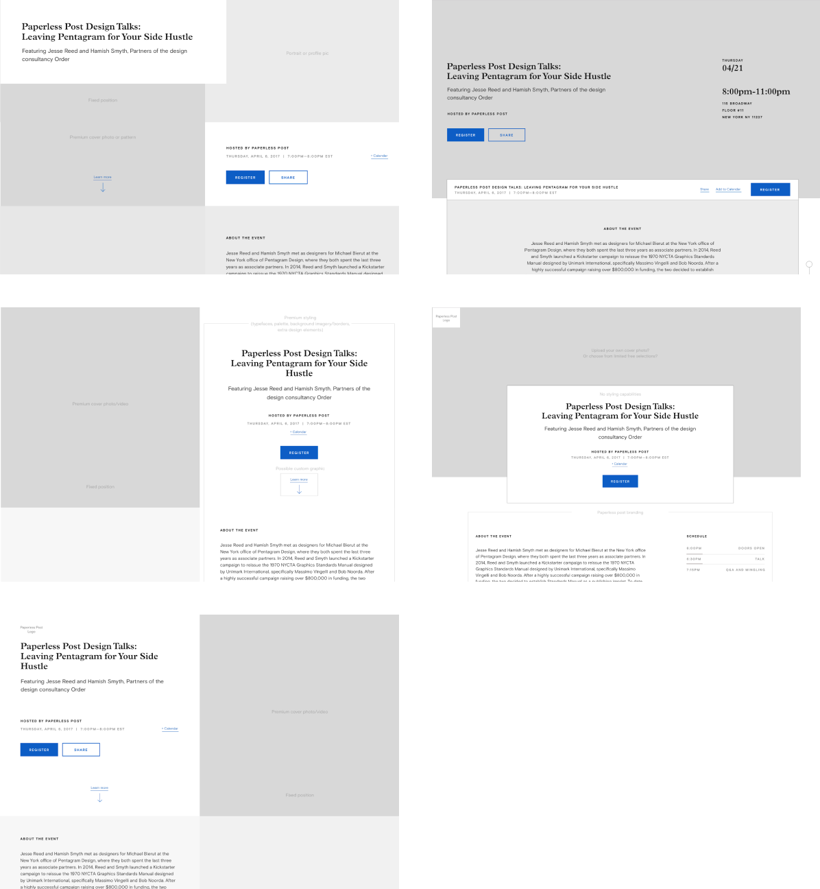
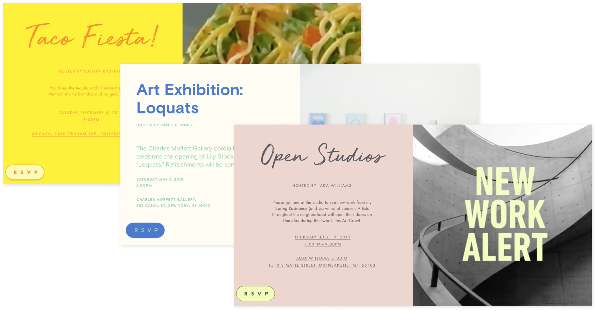
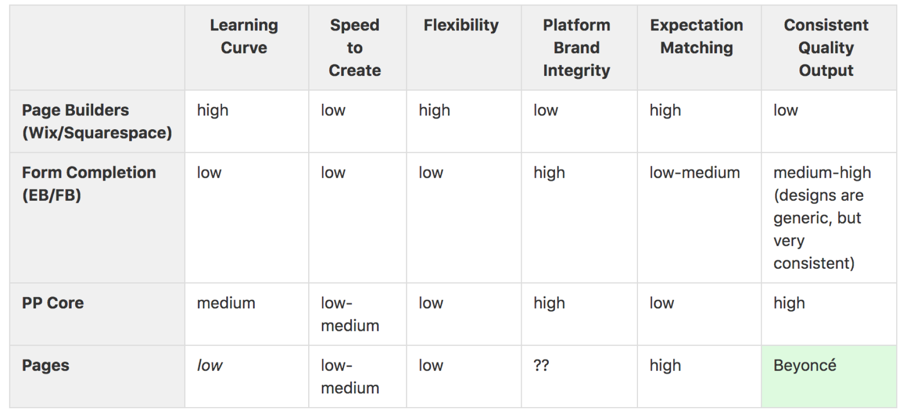
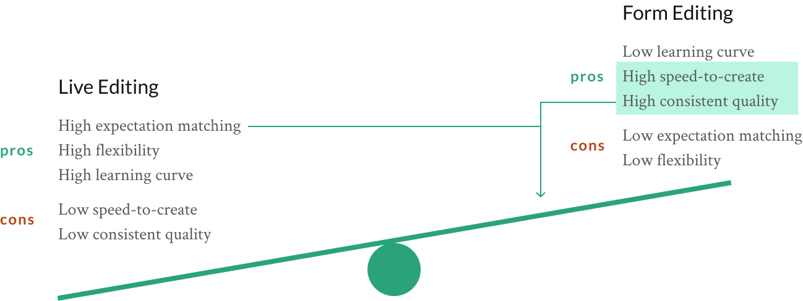
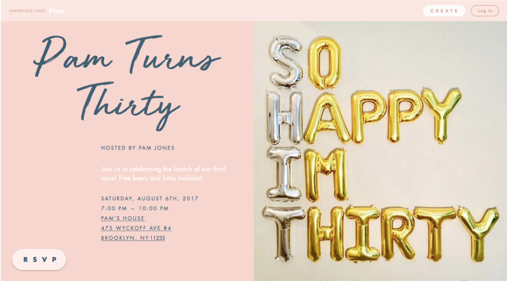
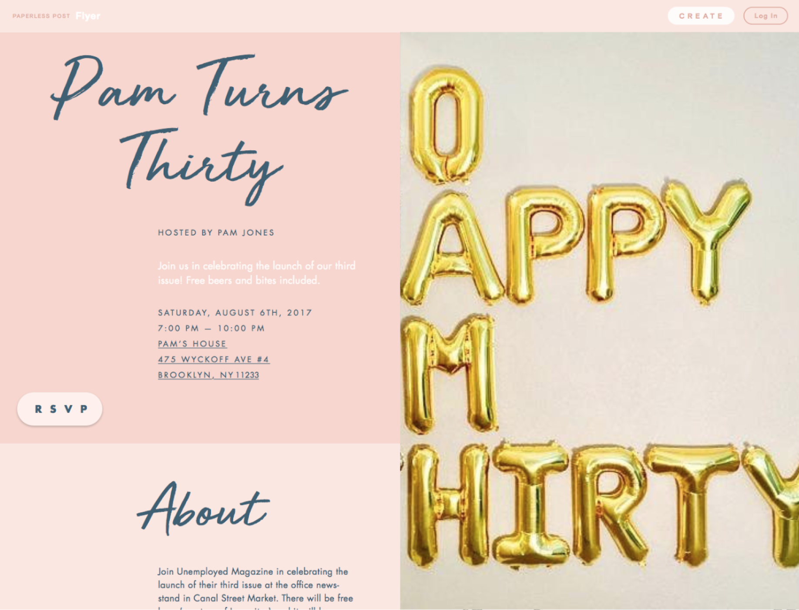
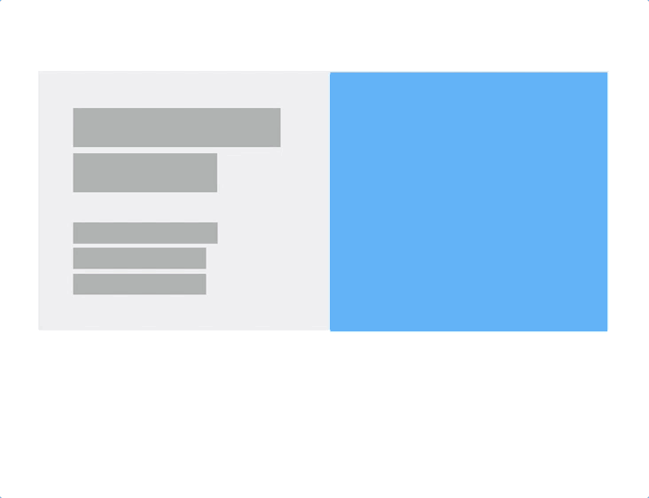

## Background

In 2017 Paperless Post made a big decision: it was time to dramatically evolve the product that had driven success for the organization for the past eight years. Paperless Post Cards had been serving a particular audience well for that time, but in some ways we had designed and marketed ourselves into a over-specialized niche without much room to grow. We were market leaders in invitations to young children's birthday parties and wedding-related events, but we knew there a wider range of event types where we could provide value. Leadership decided to start building a sister product in parallel to the core product to test into a new approach, and looked to small team to help define this new idea.

## Evolving Roles

I paired with a product manager and graphic designer to provide some early focus and definition to the product before the full project was given an organizational green-light. After the project was fully resourced and brought into beta, I worked within a feature team to help polish and improve the product for a 1.0 release.

We began the project with the Open Model as our choice, but with the knowledge that legal department heads may, in the end, veto that decision.

## How it Started

How do we evolve our offering, moving from an old world paper metaphor for invitations to something digitally native?

We presented two style tiles, a sort of refined mood-board adapted to suit projects where a basic brand might be in place, but interface patterns are not.

  

    
  

    

Remember the goal was to *evolve* the brand, not create a new one. We wanted to keep our elevated sense of design and aesthetics, elegance paired with a degree of cheekiness. But we wanted more elements that spoke to contemporary internet usage: animation, quirky type, mobile-forward design, and flexible sharing.

We also want to capture new hosts and event-types that our card product was not well suited for. Long-term the plan is to integrate both Cards and Flyers into one platform, but for now they would remain two paths under the Paperless Post umbrella, so it was important to distinguish each offering from the other.

    

The first question leadership needed answered was how the final pages user created would look. From there we could work backwards. So we took our research and experience into a room to start finding a path forward. We started by evaluating the landscape. What else is out there?

We then evaluated our research and eventually distilled our ideas into a few themes. We started applying real content onto those themes, which helped us narrow down and gain consensus on ideas.

    

A review of related sites and applications

 
 

    

A review outside of the direct industry vertical, looking for themes, trends, inspiration, etc.

 
 

    
    

Capturing and naming layouts we came across: Cover, Grid, Split, Scatter, etc

 
 

    

We eventually landed on what we called the "split" design to start out with, as it allowed ample room for both imagery and information and felt responsive friendly.

## So How Do You Make it?

So with a design direction chosen for the invitation page in place, it was time to figure out how they would actually make it. Just as we visually evaluated products in my previous examples, we now took a functional and conceptual look at how other products approached this problem. Below is the summary of an analysis of other event-page products. We felt our real edge (our "Beyoncé") was in the "consistent quality output" category.

From this research we found two basic models for editing: "live editing" and "form editing". The former often took the form of drag and drop or WYSWYG editors, while the latter were made of typical forms and separate previews. After establishing what were the most critical aspects to get right in our first release, we decided that our initial product would use more of a form-based model, and not a live-editing model. However, we would slowly iterate towards more advanced and visual editing, evaluating along the way.

    

 

    

 

Research helped facilitate decision-making, but we quickly decided to put theory to practice by moving quickly into low fidelity designs. How would our approaches hold up? What does that spot on my see-saw diagram actually look like? Below are captures of 3 basic prototypes that we evaluated as we explored how our editing model would take shape. The first version felt too formulaic and conventional, the second one overly complex for our first pass. The third one represents where we landed as a team, with agreement that the use of modals, while not terribly elegant, they allowed customers to stay in the creation experience while keeping our build costs down.

    

 

    

 

    

 

## Intermission

With some basics established, a new feature team was established to help build out the above into a functional beta. While I helped facilitate this early build, particularly through early rounds of user-testing and analysis, I was also assigned to work on a team that focused on optimizing the user experience and revenue of the original Paperless Post product (A case study of that work is coming soon).

Fast forward a few months. After the build and shortly after the beta launch, the organization shifted and decided to dedicate a majority of its resources onto the new product. The work my team had done on the original product was effective in boosting our bottom-line, and leadership felt they could use this positive baseline to invest in the future. I was assigned to lead the design and designers on a feature team that was in charge of the page creation and publishing experience.

## The 50-50 Split Problem

The first problem I was dedicated to solving on my new team was what we deemed the 50-50 Split Problem. The current iteration of the product stretched user-uploaded imagery to fit the right 50% of the screen on desktops and larger tablet views, which ended up cropping images at certain browser aspect ratios. This somewhat cryptic issue was a major source of frustration for customers, who didn't understand why their image looked different from what they uploaded.

    
    

We decided we needed to introduce more flexibility into the page. Our unique layout and decision to keep the image stretched to browser edges were difficult constraints, some of which I needed to challenge. The problem ended up being more complex than originally thought, as we had to deal with not just browser widths, a common responsive problem, but browser height and aspect ratios as well.

I coded a prototype to test out the ideas using real content and layouts. I then used my favorite static site generator, Middleman, and YAML files to test the idea across multiple themes and content variations. The prototype and solution above were well received and eventually implemented. We referred to the solution as "60-40 flex" and remains the solution in the live product.

    

    

## Motion and Character

When I ask fans of Paperless Post what they like best about the product, one of the top answers I hear is about that moment when you "open" the invitation and the card animates out of the envelope (that and the illustrations and type on the cards are by far the most common reasons people gave for using Paperless).

I believe that simple animation helps give the product an extra layer of polish and emotional character. It simply "feels" good and makes the page "feel" more alive. Because feelings are harder to quantify and measure, I find they are often deprioritized behind features and bug fixes, the value of which is more easily captured in revenue models, surveys, customer support, and even anecdotal conversation.

Paperless Post has a few hack days a year, affectionately called Stampy Days. I decided during a hack day to take a stab at introducing some motion and character to Flyer. Even in the limited time I had (2 days), I followed a similar design process as I've written about above. I started by examining the landscape to evaluate what I think works well and what doesn't and to gather some ideas and inspiration. I used light weight design tools (Principle in this case), to test out some of those ideas against real content and layouts. I then did my best to translate those ideas into code in order to prove the feasibility of the concept and to help bridge the potentially large gap between design and implementation.

    

 

    
    
    

 

    
    

Using Principle to test out some ideas

 

    

A simplified idea translated into code. Developers were able to use this as a starting place in animations that can now be seen across the site.

## What Now?

Though I no longer work at Paperless, I'm happy to say that at the time this case study was published (September 2018), Flyer remains a key part of the Paperless Post product offering and utilizes many of the concepts, features, and designs I just discussed.

Though I feel good about the work me and my team performed, I always try to think of what could have gone better, or what in hindsight I may have done differently. Not for the purpose of self-pity, but to take any learnings forward into future projects. In this case I think I underestimated how emotionally and fundamentally invested the leadership team would be in every aspect of the project, and how critical their buy-in was to move certain things forward. Were I able to go back, I would request more time with organizational leads and other stakeholders and ideally conduct a few workshops. I would have liked to align on goals and very rough goalposts, preferably written down.

In my previous life at agencies, project and account managers lock all this down to the point where it could make the work feel rote and pressured. But it also enforces a structure and the goalposts force all parties to see how aligned, or not, we are. Agile and Lean processes are great, but any project benefits from a little bit of structure.

In the end I'm proud to have helped bring an exciting new product into the real world, and love watching it grow every time I return to the site.
