---  
title: The Paperless Post Customization Tool
body_class: "pp-create"
date: 2017-09-30  
role: "Lead/Sole Designer"  
year: "2016-2017"  
blog_name: projects  
client: "Paperless Post"  
project_type: "Agile"  
index_hero_image: "/images/home/pp-create-desk-hero@2x.png"  
detail_hero_image: ""  
dash_intro: "My first project as an in-house designer at Paperless Post"  
article_intro_summary: "After years of working in consulting and freelance, in 2016 I took my first job as an in-house product designer. I wrote a bit about my <a href='http://aarongitlin.com/writings/product-design-dreams-1.html'>dreams</a> and then the <a href='http://aarongitlin.com/writings/product-design-dreams-2.html'>reality</a> of that move on my blog here."  
article_intro_role: 'Shortly after starting at Paperless, I was asked to review what we call the "Create" tool. I led research and design on this team, and worked with a cross-disciplined team of Product Managers and developers.'
published: true  
---

## Discovery & Research

I was lucky to have started off on an interesting part of the Paperless Product: the "Create" tool. This is the term we use internally for our software and the user experience of customizing a card selected by customers before they send it to their recipients.

While I was given my area of the product to own, I was not assigned any particular project. This was a perfect opportunity for me to use all those years of UX and UI consulting to evaluate the product with some level of objectivity. Unlike some of my colleagues, I had not spent years thinking about digital envelopes and event types. However, this was not my first rodeo, either. I rolled up my sleeves and started where any designer should start: research.

### 1 – Review & Analysis

I reviewed the existing customization experience, taking note of possible gaps within the experience as well as the interface itself. I also looked through our product style guide and the rest of the site. This tool was using out of date brand and style guidelines, and no longer matched the look and feel of the rest of the site. To help document the UX gaps I saw, I referred to a list of heuristics adapted from [Weinschenk and Barker's well-known classification](https://en.wikipedia.org/wiki/Heuristic_evaluation#Weinschenk_and_Barker_classification). To document the UI, I took screengrabs and screenshots and noted components that seemed particularly problematic.

### 2 – Competitor Analysis

I always find it helpful to review other products in the specific market, related industries, and a few near-universal standards (Google, Airbnb, etc.). I created a fake gmail account, signed up for a dozen or so services and went through their userflow, screenshotting and documenting my observations along the way.

### 3 – User Research

First, I got in touch with our Customer Support department. Thankfully they had a number of reports and summaries I could review. With those, I could validate a few of my own observations, as well as a number I hadn't thought about.

Second, I decided to conduct some first-hand research by conducting a few usability tests. I gave a scenario to each recipient, and took notes as they went through the service. I followed up by having them perform a few specific tasks that I created based on pain-points that had been identified in previous steps.

    

        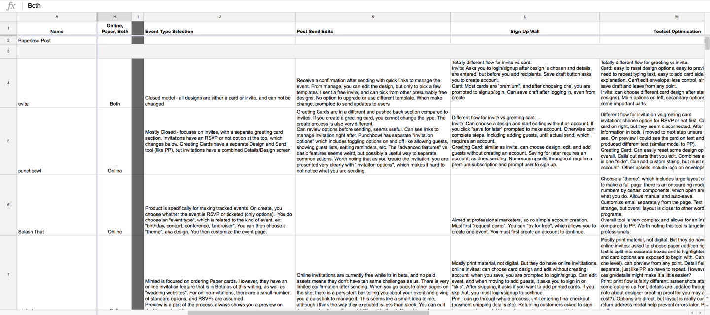
    

    
Snapshot of a competitive analysis document I put together

## Define

Now that I had a better sense of the product and its strengths and weaknesses, I was ready to start working with my team to figure out a game plan. I facilitated a few workshops aimed at providing some direction and alignment with the rest of the team who had significantly more experience with the product than myself.

A company-wide objective to invest in some technical infrastructure and testing frameworks meant the scope of design work was more limited than in my dreams, but it also meant I could establish a clear, if limited set of goals:

- Update styles to better align with the rest of the site and brand
- Add more affordance to some buttons/interactions – some users seemed unsure that some elements were interactive at all
- Add more hover/active states – a personal observation that this tool lacked such statements
- Make a few actions more noticeable – especially how to close some toolsets and remove some assets
- Expose the settings to make sure users know if they are sending their card as a greeting or an invitation
- Provide context and preferably names for the part of the card users were editing – a number of people commented on wishing they knew how many steps there were in the process, which is a common pattern in stepped guides
- And of course, do all of this with little to no infrastructural or data changes, as the developers needed for that work would be working on other projects

The last point meant the list had to stop there, but that seemed reasonable for a start. I had a backlog of important items, which I can talk more about at the end of this case study.

    

        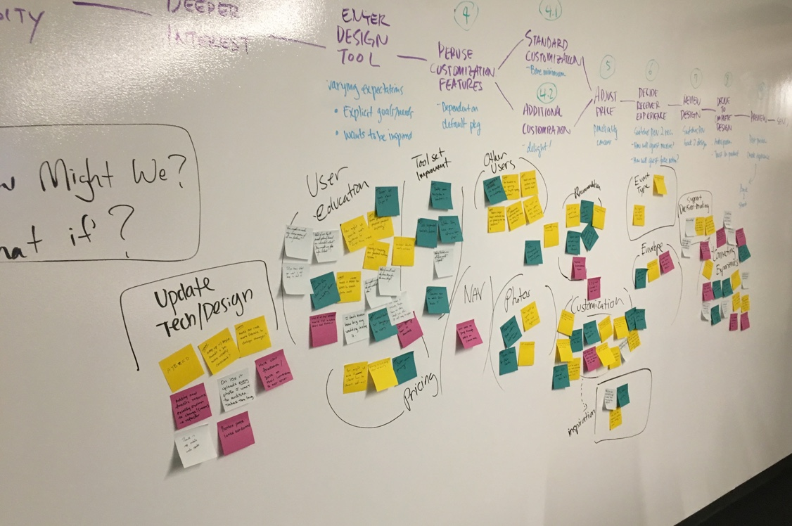
        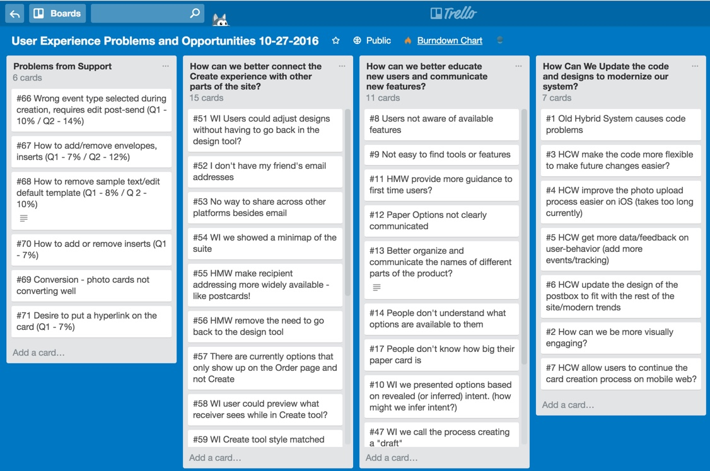
    

    
A picture of the result of our workshop, and its documentation in Trello

## Design & Documentation

    
    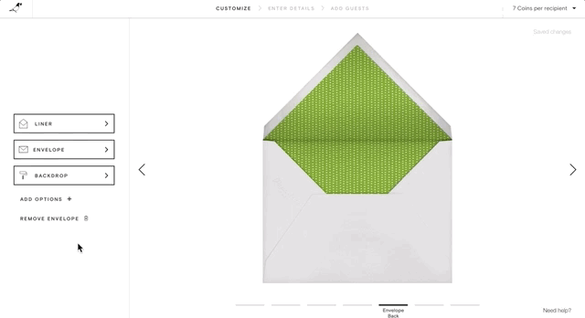

Above are some captures of a few basic flows. I created the designs using Sketch, and stitched together everything in my favorite prototyping tool, inVision. I almost always use interactive prototypes to communicate my designs, regardless of the size of the project. I find that no matter how experienced the designer, developer, or stakeholder may be, its hard to take concepts seriously until you can actually interact with them.

Unfortunately inVision has its limits. It provides few tools to communicate interaction details such as hover states, focus states, transitions, scrolls, or nearly any animation. As I stated above, I had noticed the current product was lacking in these interaction details, so I created an HTML-CSS prototype to work through a few possible solutions. One thing I wanted to do was let the user know that there was a menu below the open toolset, so I worked on a few versions and decided on something like the below.

    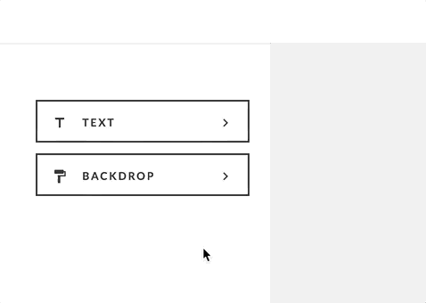
    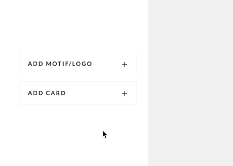

Because this first version was aiming to replace existing UI components, and not create a whole new experience, I worked with the developer to make sure all pieces were accounted for. I kept a running inventory to make things easier for us, and to make sure I was also working towards my goal of making components both more in-line with brand and with interaction expectations (buttons should look like buttons!).

    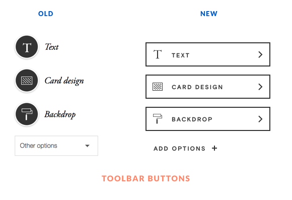
    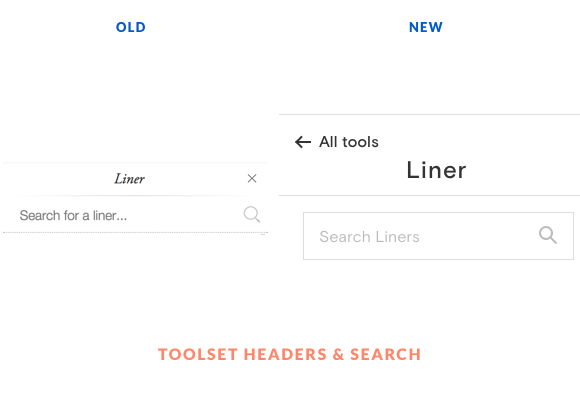
    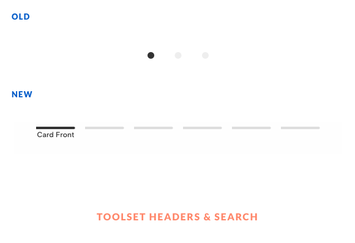

I also took advantage of Sketch's symbols, overrides, styles, and type-styles to create not just designs, but a design system. The idea is that with this system now in sync across the design team, developers would no longer be getting a variety of components. With that problem solved as upstream as possible, we can next work with developers on integrating our systems even further.

    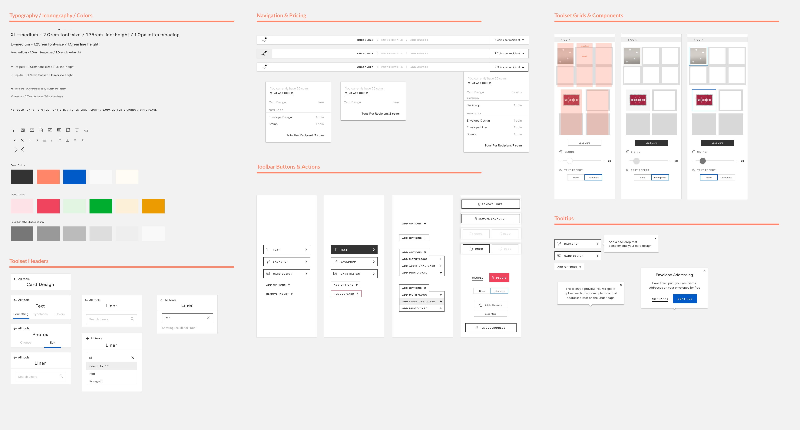
    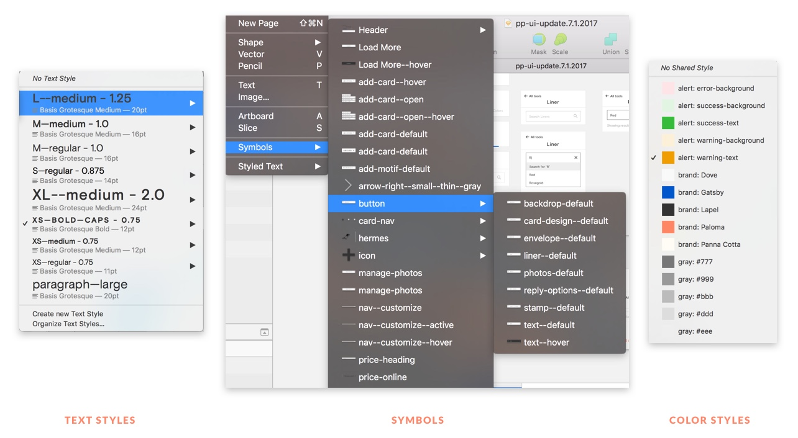

Finally, we use Zeplin as a way to package designs so that developers and project managers can review and comment without needing to open our Sketch files. I've written about Zeplin before, but I can't sing its praises enough. Its built in color and type guides alone make projects significantly easier to keep on track and avoid situations where you need to answer whether the correct light gray is #fdfdfd, #fafafa, or #f5f5f5.

    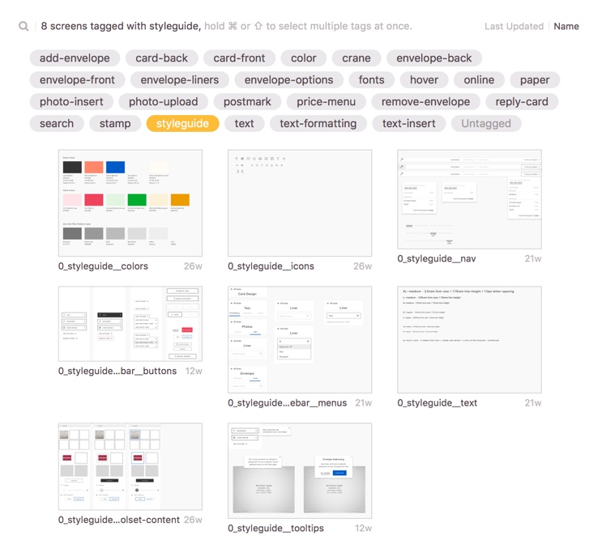
    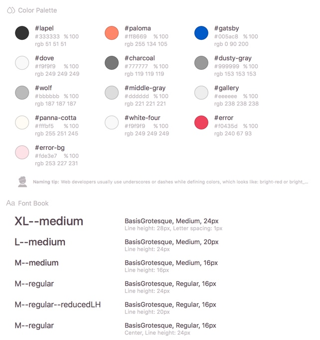

## Next Steps

There are two paths of next steps, both important. One is to continually improve the UX of the product. This includes:
- addressing navigation between the Create tool and other parts of the site
- improving the photo and text editing toolsets
- find ways to integrate previews into the flow without taking users out of their editing context

The other path involves continual UI updates and integration into the front-end architecture of the site and brand:
- the formal integration of these updates into our core Sketch style guide, defining what is universal and what is specific to the Create tool
- begin integration with our [Storybook](https://storybook.js.org/), a tool used to store and distribute our styles across our products.
