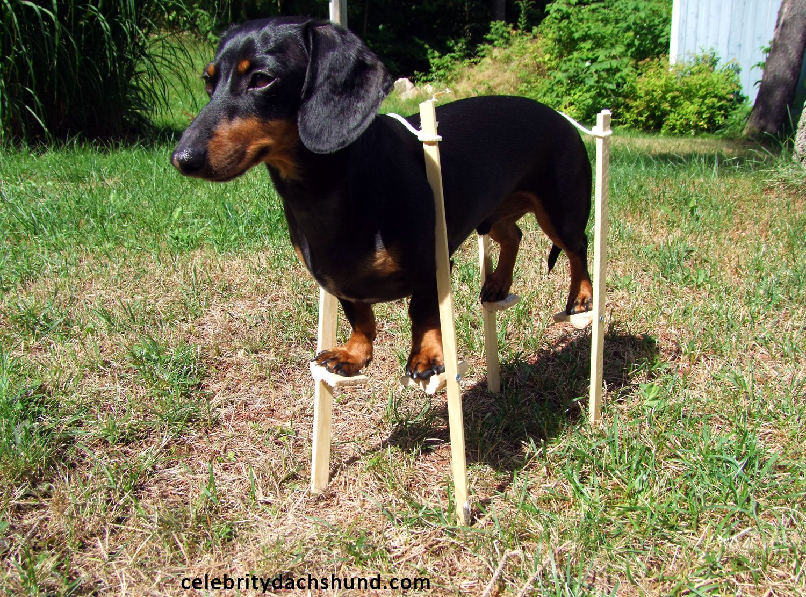

		

Like many designers out of school, my first work experiences were a combination of freelancing, and contract work. Eventually I got a job at an agency, my first official role as “UI Designer”. This seemed like a logical transition at the time, as the world of client management and requirements lists was familiar to me, and the thought of someone else actually managing the business end of things seemed like a relief. As I moved up the ladder I found myself slowly having greater responsibility than just filling in wireframes and adding dozens of Photoshop layers to give buttons textures and shadows (I miss you 2012!). I found myself having to discuss and justify my decisions with people who had little knowledge or interest in visual design thinking, and a collection of images sourced online for inspiration no longer counted as “research.”

I decided that in order to level up I needed to diversify my library of books and articles outside of graphic and UI design. I needed to learn more about UX and even, *gasp*, strategy. These finally gave me the vocabulary, if not a deep understanding, of how one might actually approach problems that these important business people kept asking me. The agency where I worked evolved as well, moving away from a process where Project Managers wireframed solutions with clients over the course of a few days, to actually implementing methodologies we read about like “stakeholder interviews” and “user testing.”

But even with all this progress, I started to feel like the agency model had a ceiling. Almost all the books, meetups, and articles I read that really dug deep into Design thinking, user research, and strategy came from in-house teams at product companies. I was reading about how Facebook, Buzzfeed, and Intercom ran their teams and conducted long term meaningful research that influenced designs.
After years of fighting clients and management for even a rudimentary research or discovery phase, and little to no user feedback on my design decisions, the arrangement described in these articles sounded like a dream. Eventually I made the switch and at the end of 2016 I applied and was accepted to join the product design team of a well established company.

##What I imagined
Before beginning the job, I imagined that a lot of my day to day responsibilities would actually be similar to my last job, only I would get more time to work on what’s “important” (user research, design iterations, team critiques, developer-pairing, QA, etc), and less time on “waste” like stakeholder management, documentation, and constant client presentations. Free from tight timelines and the multi-tasking required by hourly billing cycles, I would be free to delve deep into topics, speak to people that use the product, discover insights, and action on them. I’d be able to use my experience across research, UX, UI, prototyping and development to help lead a team through iterative and meaningful change.

How would I know it’s meaningful? Because of data, both quantitative and qualitative. We would have a dashboard of analytics plugged into all parts of the site, giving us realtime stats about how customers are using the site. From this fancy dashboard, we could get a big picture view of our platform’s health: how many people were converting? How many dropping off? How many contacting support? About what?

Then we could decide to zoom in and see how a specific test was going. Was our hypothesis that exposing certain actions instead of hiding them in a dropdown improve flow through a certain tricky session? Did it affect the number of people performing those actions? Did it affect conversion? Did it affect sales?
During a review session the team would look through this data and as a team we could make a call. Maybe we found that one test was successful and our hypothesis proved correct. Taking a few key actions out of a dropdown brought some people through the flow quicker, dropped related support requests, and increased conversion overall. A win! Great! How about another test from the week before? How about this page where we restructured some key information that we knew was confusing people?

Oh no! No change in conversion, more time spent on this page, and an increase in support tickets from the test group. A fail. Clearly our hypothesis was incorrect and we had to go back to the drawing board. No worries though, we run tests all the time. Some win and some fail and either way we keep moving forward.

##The Big Picture
While our dedicated data team and tracking tools help keep our nose to the ground and our microscope in focus, what about the big picture? The birds eye view? Blue Sky thinking? All those other cheesy metaphors that my industry loves?
Well here is where I would really outshine my liberal snowflake product designer compatriots. My agency experience may not have given me the exposure to iterative dev cycles and A/B tests that they had, but I have more experience building a product from scratch, and making big decisions quickly. We often sold “strategy” as part of our services at the agency, so clearly I knew what I was doing in this regard.

##In Conclusion
Knowing all of this, I was prepared for my job where I would:

- Spend more time on “important” tasks like user research, design iterations, team critiques, and developer pairing
- Spend less time on “waste” like stakeholder management, documentation, and constant client presentations
- Learn how to use qualitative and quantitative data in my design process thanks to a coordinated and mutli-disciplined organization
- Impress my colleagues with my ability to think big and act fast

 —---

I also posted this on [Medium](http://medium.com/@aarongitlin). I will update this article with links to my next piece, where I talk about my first 6 months on the job as a product designer.
