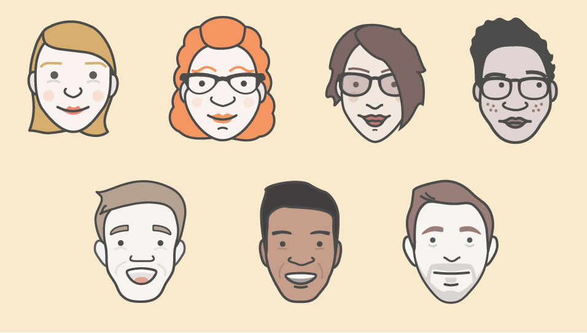
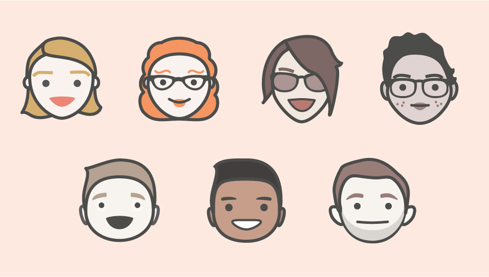
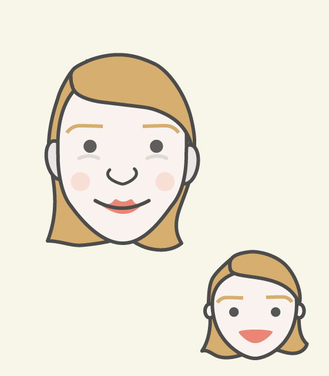
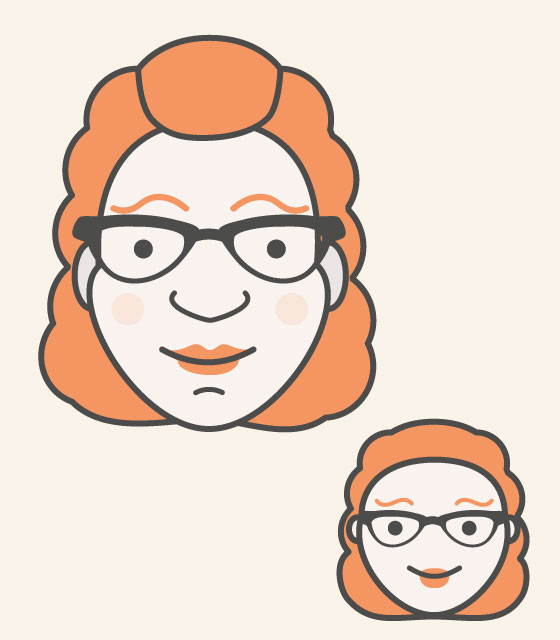
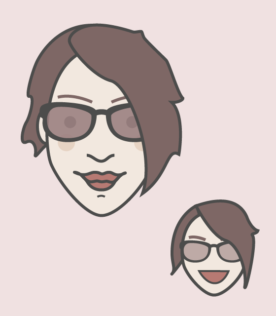
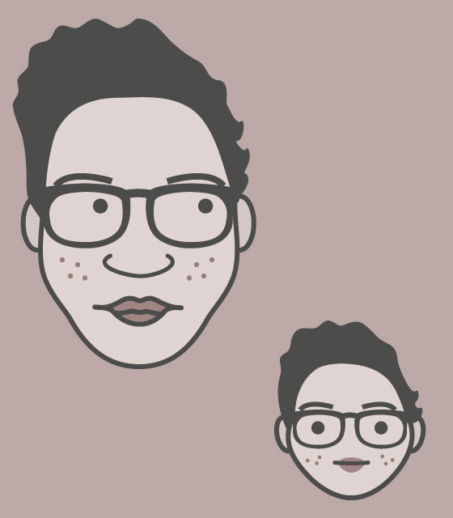
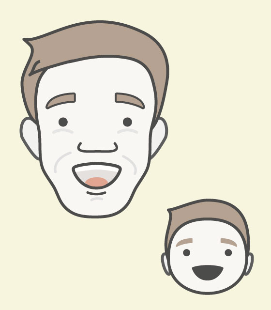
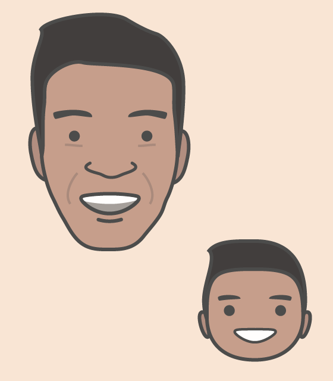

I dug some doodles up from a year or so ago, and completely forgot I started drawing avatars of some of my colleagues at the time. I'd actually love to continue this at some point, but I'm afraid I have other priorities right now. But either way, I feel like posting them somewhere, even if it's just to show some of these guys who have never seen these before. Enjoy!

Here is the first set I drew. This was our design team at this time (it's twice the size now!).

    

After this it became clear what was really needed. Cutesie baby versions!

    

Suspiciously missing is mine... Maybe that'll be next!

Finally, here are the pics with their lil' guy version in tow. 

    
    
    
    
    
    
    

